# Kodepos API Indonesia - Architecture Documentation

**High-performance Indonesian postal code API with global edge distribution**

*Author: Maxwell Alpha (https://github.com/mxwllalpha) - mxwllalpha@gmail.com*
*Version: 1.0.0*
*Architecture: Cloudflare Workers + D1 Database + TypeScript*

---

## 🏗️ System Architecture Overview

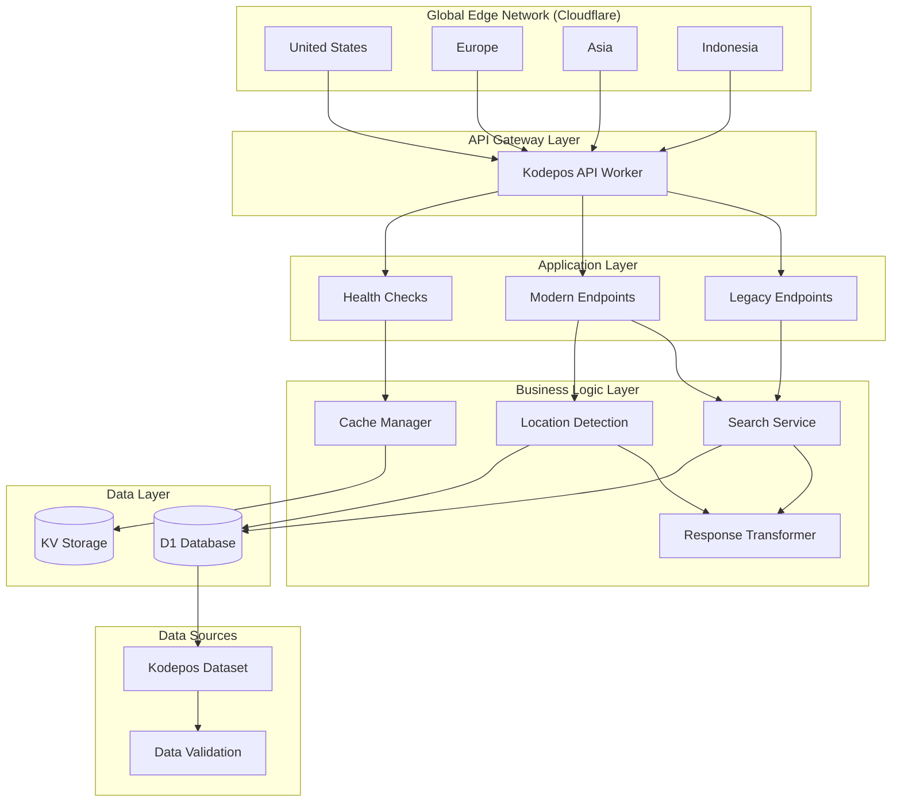

## 🚀 Component Architecture

### 1. API Gateway Layer

**Cloudflare Workers** provide the global edge computing platform:

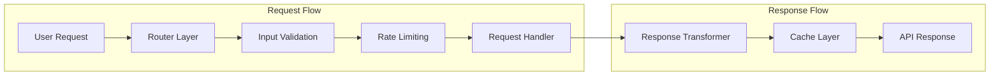

**Key Features:**
- **Global Distribution**: 200+ edge locations worldwide
- **Auto-scaling**: Automatic scaling based on demand
- **Low Latency**: <100ms response times globally
- **Security**: DDoS protection and security headers

### 2. Application Layer

**Dual API Architecture** ensures backward compatibility:

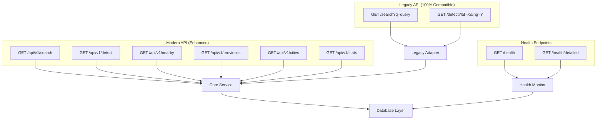

### 3. Business Logic Layer

**Core Services** handle business logic and data processing:

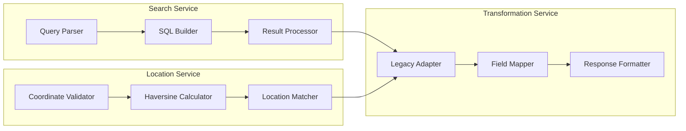

### 4. Data Layer

**Cloudflare D1 + KV Storage** provide data persistence and caching:

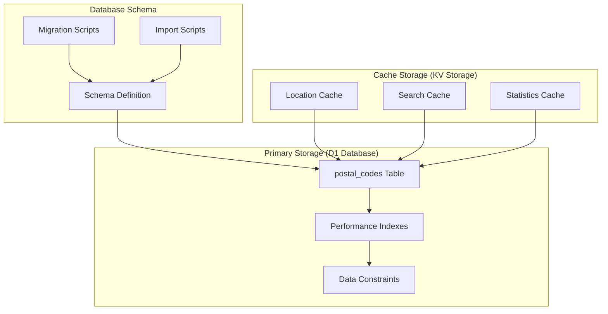

---

## 📊 Database Architecture

### Schema Design

**Main Table: postal_codes**
```sql
CREATE TABLE postal_codes (
    id INTEGER PRIMARY KEY AUTOINCREMENT,
    kodepos INTEGER NOT NULL,
    kelurahan TEXT NOT NULL,
    kecamatan TEXT NOT NULL,
    kota TEXT NOT NULL,
    provinsi TEXT NOT NULL,
    latitude REAL NOT NULL,
    longitude REAL NOT NULL,
    elevation INTEGER,
    timezone TEXT DEFAULT 'WIB',
    created_at DATETIME DEFAULT CURRENT_TIMESTAMP,
    updated_at DATETIME DEFAULT CURRENT_TIMESTAMP
);
```

**Performance Indexes**
```sql
-- Primary indexes for query performance
CREATE INDEX idx_postal_codes_kodepos ON postal_codes(kodepos);
CREATE INDEX idx_postal_codes_provinsi ON postal_codes(provinsi);
CREATE INDEX idx_postal_codes_kota ON postal_codes(kota);
CREATE INDEX idx_postal_codes_kecamatan ON postal_codes(kecamatan);
CREATE INDEX idx_postal_codes_kelurahan ON postal_codes(kelurahan);

-- Location indexes for geo-queries
CREATE INDEX idx_postal_codes_coordinates ON postal_codes(latitude, longitude);

-- Composite indexes for common queries
CREATE INDEX idx_postal_codes_prov_kota ON postal_codes(provinsi, kota);
CREATE INDEX idx_postal_codes_kota_kecamatan ON postal_codes(kota, kecamatan);
```

### Data Relationships

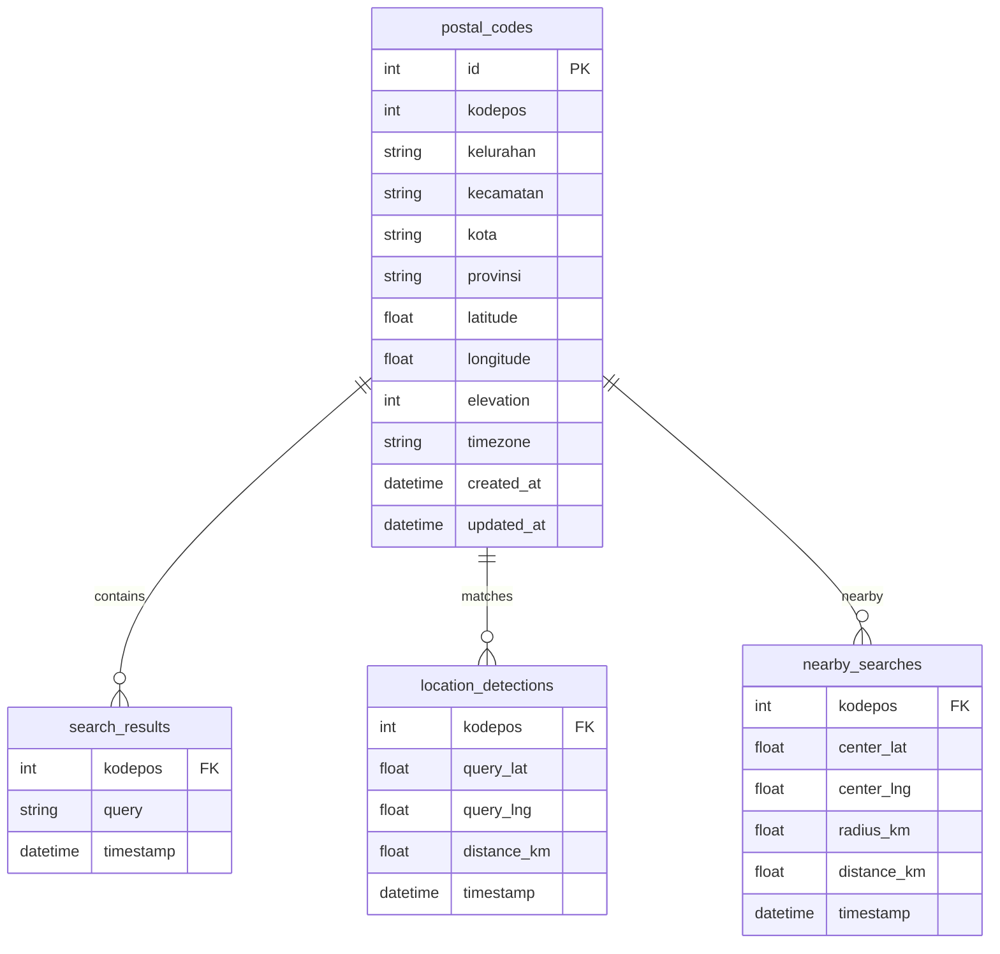

---

## 🔄 Request Flow Architecture

### Search Request Flow

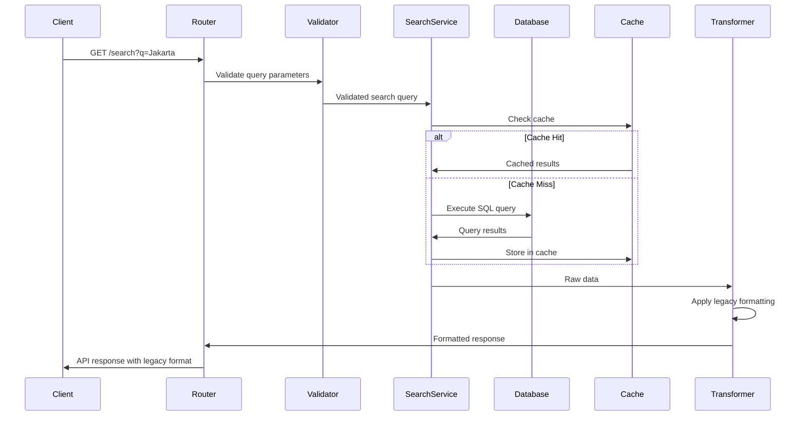

### Location Detection Flow

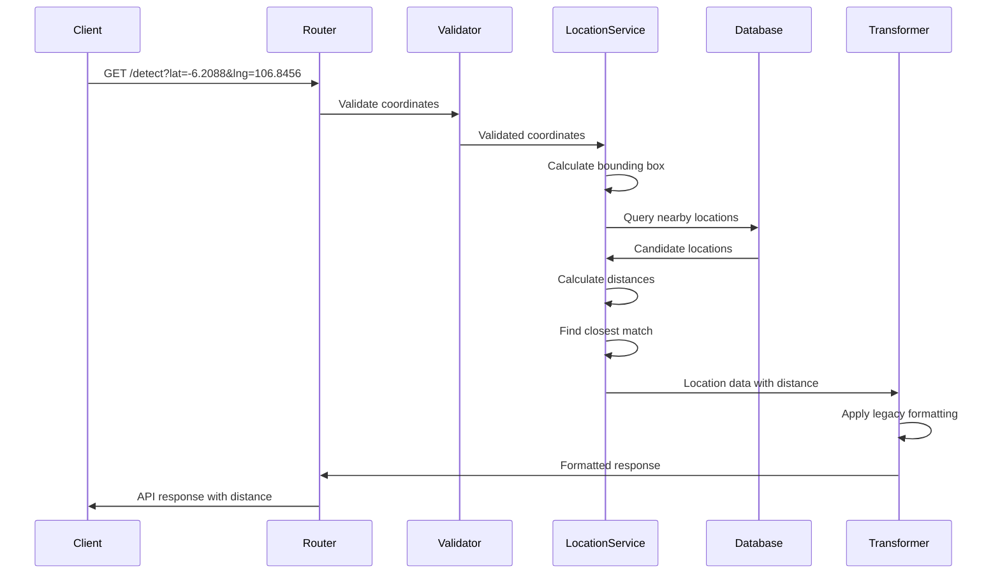

### Modern API Search Flow

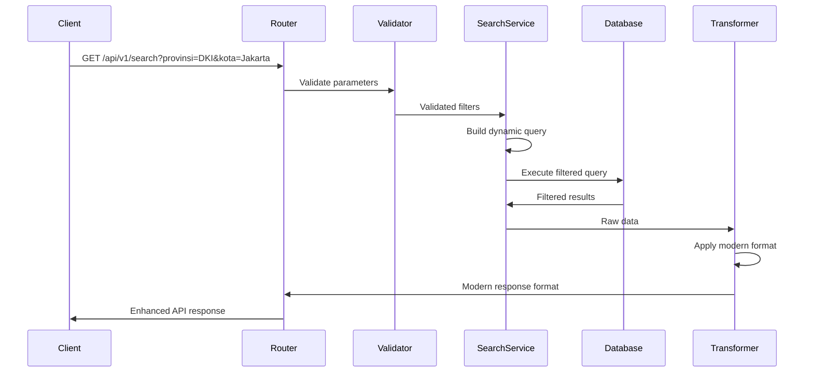

---

## 🚀 Performance Architecture

### Caching Strategy

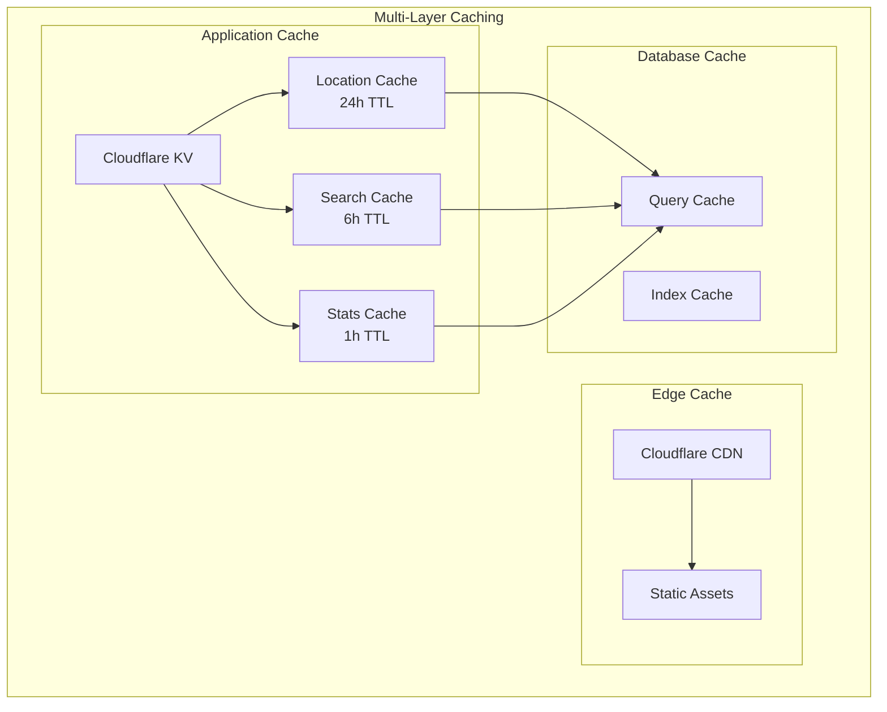

### Performance Metrics

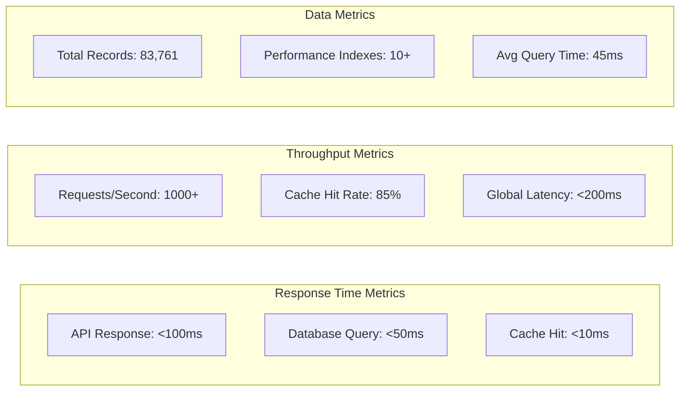

### Scalability Architecture

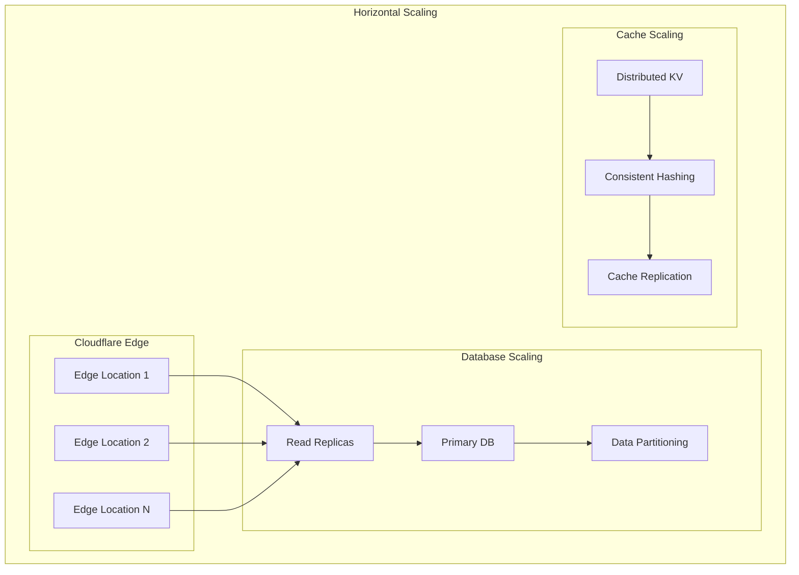

---

## 🔒 Security Architecture

### Security Layers

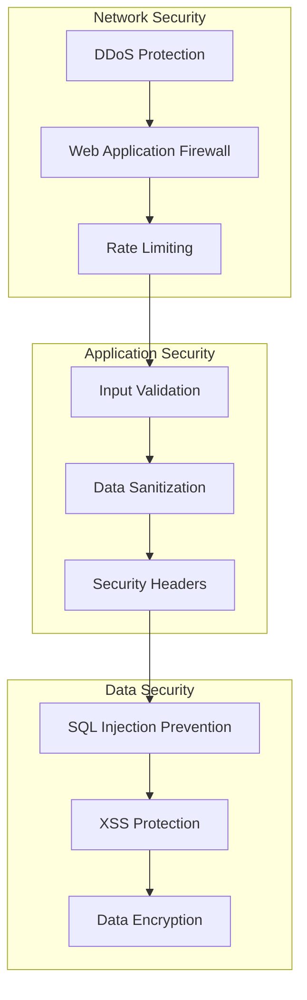

### Security Headers Implementation

```typescript
const securityHeaders = {
  'X-Content-Type-Options': 'nosniff',
  'X-Frame-Options': 'DENY',
  'X-XSS-Protection': '1; mode=block',
  'Strict-Transport-Security': 'max-age=31536000; includeSubDomains',
  'Content-Security-Policy': "default-src 'self'",
  'Referrer-Policy': 'strict-origin-when-cross-origin'
};
```

### Rate Limiting Strategy

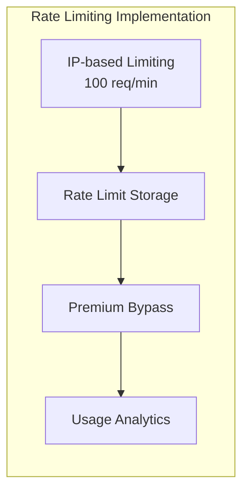

---

## 🔧 Deployment Architecture

### Deployment Pipeline

```mermaid
graph LR
    subgraph "Development"
        Local[Local Development]
        Testing[Unit Testing]
        Integration[Integration Testing]
    end

    subgraph "CI/CD Pipeline"
        Build[Build Process]
        Quality[Code Quality]
        Security[Security Scan]
    end

    subgraph "Production"
        Staging[Staging Environment]
        Production[Production Deploy]
        Monitor[Performance Monitoring]
    end

    Local --> Testing
    Testing --> Integration
    Integration --> Build

    Build --> Quality
    Quality --> Security
    Security --> Staging

    Staging --> Production
    Production --> Monitor
```

### Environment Architecture

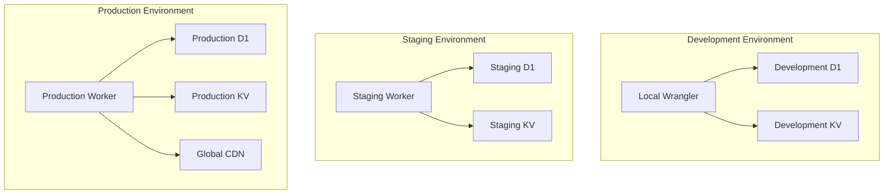

---

## 📈 Monitoring & Observability

### Health Check Architecture

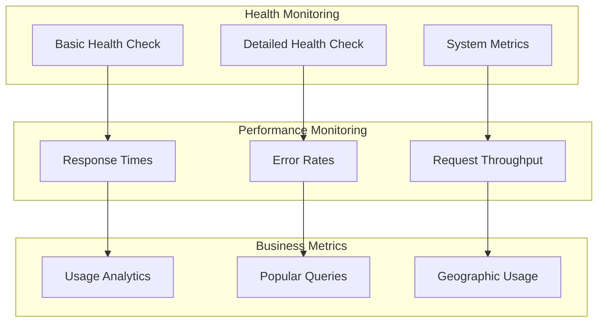

### Logging Architecture

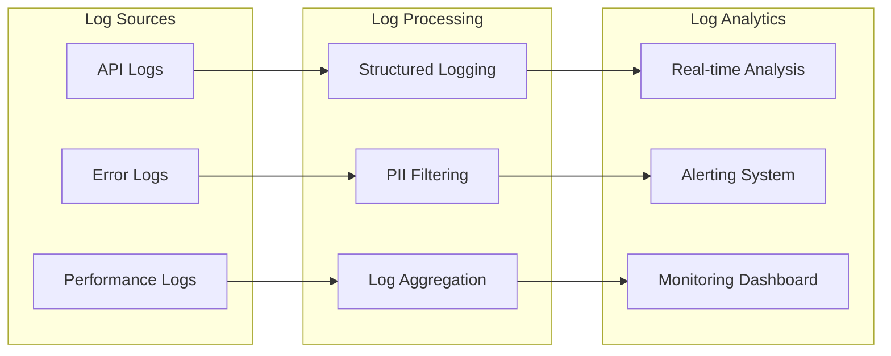

---

## 🔮 Future Architecture Enhancements

### Scalability Improvements

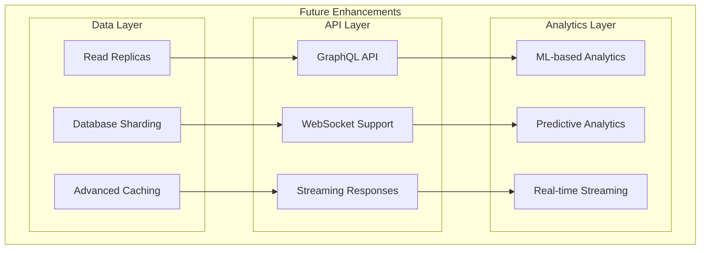

### Feature Roadmap Architecture

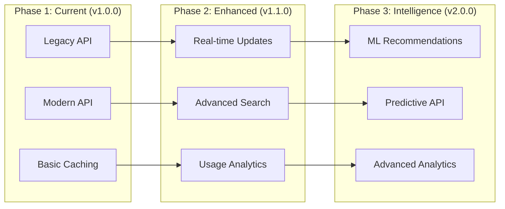

---

## 📋 Architecture Decision Records (ADRs)

### ADR-001: Dual API Architecture
**Decision**: Implement both legacy and modern APIs
**Rationale**: Ensure 100% backward compatibility while providing enhanced features
**Consequences**: Maintain separate adapter services, additional code complexity

### ADR-002: Cloudflare Native Stack
**Decision**: Use Cloudflare Workers + D1 + KV
**Rationale**: Global distribution, auto-scaling, cost-effectiveness
**Consequences**: Vendor lock-in, limited database features

### ADR-003: Comprehensive Data Coverage
**Decision**: Include all 83,761 postal codes with coordinates
**Rationale**: Provide complete coverage for Indonesian market
**Consequences**: Large dataset size, optimization challenges

### ADR-004: Multi-layer Caching Strategy
**Decision**: Implement CDN, KV, and application-level caching
**Rationale**: Achieve sub-100ms response times globally
**Consequences**: Cache invalidation complexity, consistency challenges

---

*Last Updated: November 26, 2025*
*Architecture Version: 1.0.0*
*Author: Maxwell Alpha (https://github.com/mxwllalpha)*